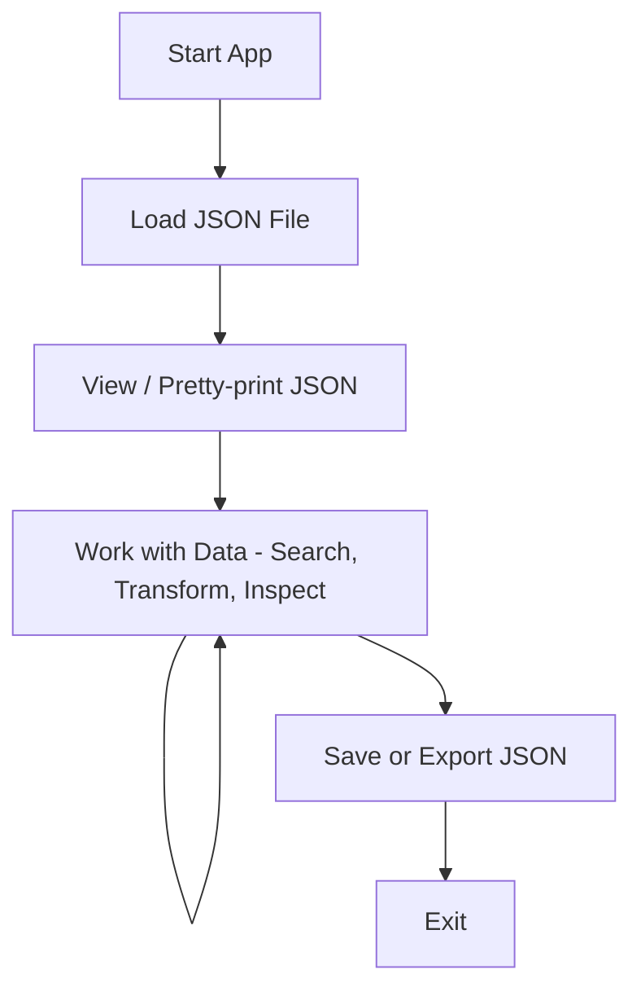

### 1. **Define the Project**

- **Goal:** What exactly do you want to build? (Be specific.)
- **Outcome:** What will “done” look like? (Define a “Minimum Viable Product” or MVP.)
- **Constraints:** Any deadlines? Technology choices? (E.g., only using Rust or must run on Linux.)

#### **Goal**:

- Create a terminal-based program for viewing, searching, transforming, validating, and creating JSON files, with support for custom immutable data operations via a simple scripting DSL.

#### **Outcome**:

- A terminal app where users can load and inspect JSON, perform and save map/filter/reduce-style transformations immutably, search data, validate structure, and create or save new JSON files—all with clear commands and basic documentation.

#### **Constraints**:

- Linux based
- terminal-based
- All transformations must be immutable (never overwrite the original data).
- Must be usable offline (no cloud/API dependencies).
- Should be easy to install and run with minimal setup.

---

### 2. **Break Down the Project**

- **Feature List:** Write out all features/requirements you want.
- **Prioritize:** Rank them: “Must-have,” “Nice-to-have,” “Optional.”
- **Divide Into Tasks:** Break features into bite-sized tasks (as small as possible).

#### **Feature List:**

- Load and view JSON data from files in the terminal
- Validate JSON data
- Search within JSON data
- Apply immutable transformations (map, filter, reduce)
- Script and automate tasks with a simple DSL
- Create and save new JSON files
- Clear terminal interface and user feedback
- Interactive command prompt with real-time feedback
  - Always displays outer parentheses for S-expressions, greyed out and non-editable, providing a clear command “container.”
  - Users type commands inside the parentheses.
  - Supports multi-line editing: Enter adds a new line inside the expression; Enter at the end submits the command for execution.
  - Auto-complete for variables and commands, shown as greyed-out suggestions (Tab to accept).
  - Integrates seamlessly with your DSL, reducing cognitive load and making S-expression commands fast and intuitive.
- Basic documentation and easy installation

### **Prioritize:**

#### **Must-have**

- Load and view JSON data from files in the terminal (pretty-print, human-readable)
- Validate JSON data
- Search/query within JSON data
- Apply immutable transformations (map, filter, reduce)
- Support multiple variables (assign results to new names)
- Create and save new JSON files
- Type information/inspection commands
- Interactive command prompt with:
  - Real-time feedback
  - Auto-complete for variables and commands
  - Always-visible, non-editable outer parentheses for S-expressions
  - Multi-line editing and smart Enter behavior
- Clear terminal interface and user feedback
- Command history and undo
- Basic documentation and easy installation

#### **Nice-to-have**

- Pipelines/chaining of commands (e.g., filter then map in a single expression)
- Scripting and automation (run batch commands from a file/DSL)
- Import/export to/from different file formats
- Diff and patch functionality (compare and merge JSON variables/files)

#### **Optional**

- Git integration (versioning and reverting changes to JSON files)
- Plugin system (load custom transformations as Rust plugins or WASM modules)
- Advanced extensibility (user-defined data operations, hot-loading plugins)

### **Divide Into Tasks:**

#### **1. Project Setup**

- [x] Initialise version control (Git repository)
- [ ] Set up project structure (folders, main file, dependencies)
- [x] Create initial README with project description

#### **2. Core JSON Operations**

**Loading & Viewing**

- [ ] Implement CLI command to open/load a JSON file
- [ ] Parse JSON file and handle errors
- [ ] Pretty-print JSON data in terminal

**Validation**

- [ ] Add command to validate loaded JSON
- [ ] Display clear validation errors to user

**Saving & Creating**

- [ ] Implement command to write/save JSON data to a file
- [ ] Allow creating new, empty JSON objects/arrays via command

#### **3. Data Interaction & Manipulation**

**Variables**

- [ ] Allow assigning any transformation/result to a named variable
- [ ] Store and manage multiple variables in session

**Search/Query**

- [ ] Add command to search for keys/values within loaded JSON
- [ ] Print matching results in readable format

**Type Inspection**

- [ ] Implement command to show type info for variables/values

**Immutable Transformations**

- [ ] Implement `map` operation
- [ ] Implement `filter` operation
- [ ] Implement `reduce` operation
- [ ] Ensure transformations do not mutate original data

#### **4. Interactive Command Prompt**

**Prompt & REPL Basics**

- [ ] Build interactive prompt that accepts commands
- [ ] Support command history (up/down arrows)
- [ ] Implement undo for last transformation or action

**Smart S-Expression Interface**

- [ ] Display non-editable, greyed out outer parentheses in prompt
- [ ] Allow typing inside parentheses onl
- [ ] Support multi-line input within parentheses
- [ ] On Enter at end, execute command; Enter inside = new line

**Auto-Completion**

- [ ] Implement auto-complete for commands and variable names (Tab to accept)
- [ ] Show suggestions as greyed-out text

**Clear Feedback**

- [ ] Display errors, confirmations, and result previews in the interface

### **5. Documentation & User Experience**

- [ ] Write clear usage instructions in README
- [ ] Document each command with examples
- [ ] Add install/setup instructions

#### 3. **Plan the Architecture**

- **Sketch it out:** Draw a simple diagram (boxes and arrows) showing how parts interact.
- **Decide on tech stack:** Languages, frameworks, libraries, databases, etc.
- **Directory Structure:** Plan your file/folder structure in advance.

### **Sketch:**

### **Tech stack**

##### JSON Handling (Parsing, validation, printing, saving JSON)

- **serde** + **serde_json**
  - _serde_ is the de facto standard for serialisation/deserialization in Rust.
  - _serde_json_ provides parsing, pretty-printing, and manipulation of JSON.
- simd-json (High-performance JSON parsing (can be overkill unless you process massive files))

Use **serde** and **serde_json** for reliability, community support, and flexibility.

##### Terminal Interface

- **reedline**
  - Highly customizable, supports multi-line input, auto-completion, syntax highlighting, and plugins.
  - reedline on crates.io

##### Command Modelling

- Command layer
  - Define each command as an object or function with a common interface. _(In Rust, usually an enum with variants for each command, or a trait that commands implement.)_
- Parsing layer (Parser / DSL Interpreter) (the program works with parsed commands, not raw strings.)
  - Have a layer that parses user input (from REPL or DSL) and turns it into command objects (like your enum or struct).
  - Converts raw user input (or scripts/DSL code) into command structures your program understands.
- Eval layer
  - Each command knows how to execute itself (often an `eval()`, `run()` or `execute()` method). Also with an `undo()` method
  - Keeps logic separate from input handling.

##### State Management

- Keeps track of loaded data, variables, command history, undo/redo stacks, etc.
- Think: your “AppState” struct.

---

#### 4. **Set Up Version Control**

- **Git:** Create a Git repository on GitHub or locally.
- **Commits:** Commit early, commit often. Each commit should have a clear, descriptive message.

---

#### 5. **Schedule and Track Progress**

- **Kanban board:** Wekan. Make columns: To Do / In Progress / Done.
- **Timebox:** Set aside dedicated time, even if just an hour a day (Consistency beats intensity).

---

#### 6. **Start Building**

- **Start small:** Get something working as soon as possible (even a “Hello, World!” for your stack).
- **Iterate:** Add features one at a time, regularly testing and integrating as you go.

---

#### 7. **Test As You Go**

- **Manual testing:** Regularly run/test your code.
- **Automated tests:** Add unit tests if possible, especially for logic-heavy parts.

---

#### 8. **Refactor and Polish**

- **Refactor:** Once something works, clean up the code before moving on.
- **Polish:** Only after core features work, focus on UI/UX or optimization.

---

#### 9. **Document**

- **README:** What your project is, how to install/run, and basic usage.
- **Comments:** Add explanations for tricky code parts.

---

#### 10. **Finish and Release**

- **Final checks:** Test all features, fix bugs, and ensure your README is up to date.
- **Share:** Push your code public (if open source), or deploy your app.

---
